# BugBounty-Agent — Architecture & Agent Specification

This document details the architectural model of **BugBounty-Agent**, defining the responsibilities and operational boundaries of the single primary orchestrator and its modular skills catalog.

---

## Architectural Model: Single Agent with Modular Skills

> [!IMPORTANT]
> **Single-Agent Decision**: This repository is designed around **ONE OpenCode agent named exactly `Bug-Bounty`** (`.opencode/agents/bug-bounty.md`). All specialized bug bounty research capabilities are implemented as **17 modular skills** (`.opencode/skills/`), rather than separate subagents.
>
> *The previous 14-agent multi-agent architecture will be explored in a separate, dedicated repository in the future. It is intentionally NOT merged into this repository.*

```mermaid
flowchart TD
    User["Security Researcher / User"] --> Orchestrator["Bug-Bounty (OpenCode Orchestrator)"]

    subgraph "Core Boundaries & Intelligence Skills"
        Orchestrator --> S1["scope-management"]
        Orchestrator --> S2["asset-intelligence"]
        Orchestrator --> S3["reconnaissance"]
        Orchestrator --> S17["knowledge-research"]
    end

    subgraph "Attack Surface & Technology Skills"
        Orchestrator --> S4["web-security"]
        Orchestrator --> S5["javascript"]
        Orchestrator --> S6["api-security"]
        Orchestrator --> S11["browser"]
        Orchestrator --> S12["oob"]
    end

    subgraph "Vulnerability Testing Skills"
        Orchestrator --> S7["authorization"]
        Orchestrator --> S8["injection"]
        Orchestrator --> S9["business-logic"]
        Orchestrator --> S10["cloud-security"]
    end

    subgraph "Quality & Delivery Skills"
        Orchestrator --> S13["validation"]
        Orchestrator --> S14["deduplication"]
        Orchestrator --> S15["evidence"]
        Orchestrator --> S16["reporting"]
    end
```

---

## The Primary Agent: `Bug-Bounty`

| Property | Value |
| :--- | :--- |
| **Agent Name** | `Bug-Bounty` |
| **File Location** | `.opencode/agents/bug-bounty.md` |
| **Mode** | `primary` |
| **Subagent Depth** | `1` (Direct orchestration; subagents disabled) |
| **Core Role** | Senior Security Research Orchestrator |
| **Operating Boundary** | Strict hypothesis-driven methodology. Never runs unvetted scans or destructive actions. Offline scope validation before all network activity. |

### Operational Responsibilities

1. **Intake & Scope Binding**: Loads target definition, evaluates against `scope.yaml` using `scope-management`.
2. **Asset Intelligence**: Builds recursive subdomain hierarchy to arbitrary depth using `asset-intelligence`.
3. **Reconnaissance**: Dispatches passive and active reconnaissance through `reconnaissance` and CLI wrappers.
4. **Surface Analysis**: Discovers endpoints, routes, tokens, and schemas using `web-security`, `javascript`, and `api-security`.
5. **Targeted Hypothesis Testing**: Tests specific vulnerabilities using `authorization`, `injection`, `business-logic`, `cloud-security`, `browser`, and `oob`.
6. **Validation & Quality Control**: Eliminates false positives via `validation`, prevents repeated tests via `deduplication`, and stores signed evidence with `evidence`.
7. **Professional Disclosure**: Generates publication-ready 17-section reports using `reporting`.

---

## The 17 Modular Skills Catalog

| Skill Name | Capability Category | Key Objective & Constraint |
| :--- | :--- | :--- |
| **`scope-management`** | Scope Verification | Pure logic verification against `scope.yaml`. Zero network traffic. Precedence: Exclusions > Specific > Wildcards. |
| **`asset-intelligence`** | Asset Discovery & Graph | Arbitrary-depth recursive subdomain discovery, DNS records, IP/ASN, TLS SAN, CDN attribution. |
| **`reconnaissance`** | Controlled Recon | Passive sources first (crt.sh, subfinder), rate-limited active probing (`httpx`), tech fingerprinting. |
| **`web-security`** | Web Surface Mapping | Authentication mechanisms, session tokens, CORS reflection, CSRF defenses, open redirects, uploads. |
| **`javascript`** | Frontend Intelligence | Client-side route extraction, source map recovery, secret triage (public vs privileged), DOM sinks. |
| **`api-security`** | API Surface | REST methods (`OPTIONS`, `PUT`, `DELETE`), GraphQL introspection & query depth, schema parameter fuzzing. |
| **`authorization`** | Access Control | Horizontal/vertical BOLA/IDOR, BFLA, multi-tenant isolation. Requires dual-account evidence. |
| **`injection`** | Safe Input Testing | Non-destructive proofs (time delay, arithmetic markers like `{{7*7}}`) for XSS, SQLi, SSTI, command injection. |
| **`business-logic`** | Logic & Workflows | Multi-step workflow bypasses, race conditions, negative quantity manipulation. Zero financial harm. |
| **`cloud-security`** | Cloud Review | Public S3/GCS buckets, metadata SSRF (`169.254.169.254`), dangling CNAME takeovers. Never attack 3rd parties. |
| **`browser`** | Dynamic Web Analysis | Headless Playwright browser automation, SPA DOM evaluation, storage inspection, client WebSocket monitoring. |
| **`oob`** | Out-of-Band Testing | Interactsh integration, blind SSRF/XXE/RCE callback verification, correlation of DNS/HTTP interactions. |
| **`validation`** | Adversarial QC | 6-gate verification checklist: challenges candidate findings, eliminates scanner false positives, scores confidence. |
| **`deduplication`** | Deduplication & State | Test fingerprinting (SHA-256) to eliminate redundant probes; clusters findings by root cause. |
| **`evidence`** | Evidence Management | Cryptographic SHA-256 hashing of request/response pairs, automatic credential redaction, local storage outside Git. |
| **`reporting`** | Disclosure Reports | Generates 17-section markdown disclosure reports. Realistic CVSS scoring. Strictly zero automated submission. |
| **`knowledge-research`** | Intelligence Research | Public vulnerability research (HackerOne disclosures, CVE, CWE, CISA KEV, OWASP) for hypothesis formulation. |

---

## Research Workflow Stages

1. **Intake & Scope Binding**:
   * Researcher initializes workspace via `bb-init <program-name>`.
   * Scope rules are configured in `scope.yaml`.
   * `scope-management` validates all target domains, URLs, and CIDRs offline.

2. **Reconnaissance & Inventory Modeling**:
   * `reconnaissance` and `asset-intelligence` build normalized, arbitrary-depth asset hierarchies into `state/assets.json`.

3. **Attack Surface Mapping & Hypothesis Formulation**:
   * `web-security`, `javascript`, and `api-security` identify endpoints, parameters, and client logic.
   * `Bug-Bounty` formulates structured hypotheses (e.g., `HYP-001: /api/v1/users/:id lacks tenant authorization`).

4. **Targeted Testing**:
   * `Bug-Bounty` applies testing skills (`authorization`, `injection`, `business-logic`, etc.) executing minimal, non-disruptive tests.
   * Test fingerprints are indexed in `state/tests.json` to prevent repetitive probes.
   * Raw HTTP interactions are redacted and signed via `evidence`.

5. **Validation, Deduplication & Reporting**:
   * `validation` challenges candidate findings against the 6-gate checklist.
   * `deduplication` merges root-cause duplicates and flags existing coverage.
   * `reporting` renders standard 17-section Markdown disclosure reports in `reports/` for human review.
