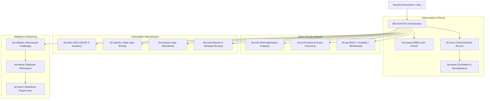

# BugBounty-Agent — Agent Architecture & Hierarchy

This document details the multi-agent system of **BugBounty-Agent**, outlining the responsibilities, interaction models, and operational boundaries of the primary orchestrator and specialist subagents.

---

## Orchestration Overview

The agent framework operates under a strict, hypothesis-driven hierarchy. Automated vulnerability scanning without hypothesis and validation is explicitly forbidden.

---

## Agent Directory

| Agent Name | Role | Primary Skills | Key Operating Boundary |
| :--- | :--- | :--- | :--- |
| **`bb-hunter`** | Main Orchestrator | `scope-management`, `reporting`, `validation` | Coordinates specialists; never runs unvetted scans. |
| **`bb-scope`** | Scope Verification | `scope-management` | **Zero network traffic**. Pure logic checking against `scope.yaml`. |
| **`bb-recon`** | Reconnaissance | `asset-discovery`, `scope-management` | Controlled rate limits; passive sources first. |
| **`bb-asset`** | Asset Correlation | `asset-correlation` | Normalization, hierarchy depth, duplicate merging. |
| **`bb-web`** | Web Application | `web-mapping`, `evidence-management` | Authentication, sessions, CORS, CSRF, error mapping. |
| **`bb-js`** | JavaScript Analysis | `javascript-analysis` | Route extraction, source maps. Tokens != automatic bugs. |
| **`bb-api`** | API Security | `api-analysis` | REST verbs, GraphQL introspection, parameter schemas. |
| **`bb-authz`** | Authorization | `authorization-analysis`, `evidence-management` | BOLA/IDOR. Requires dual-account evidence. |
| **`bb-injection`**| Injection Specialist| `injection-analysis`, `evidence-management` | Strictly non-destructive probes (time delay, arithmetic). |
| **`bb-business-logic`** | Business Logic | `business-logic-analysis`, `evidence-management` | Workflows & state machines. Zero real financial side-effects. |
| **`bb-cloud`** | Cloud Review | `cloud-review` | Public buckets & SSRF. Never attack unrelated 3rd-party clouds. |
| **`bb-validator`** | Adversarial Validator| `validation`, `evidence-management` | Treats all candidates as untrusted. Eliminates false positives. |
| **`bb-dedup`** | Deduplication | `deduplication` | Fingerprints tests; consolidates root-cause duplicates. |
| **`bb-report`** | Report Specialist | `reporting`, `evidence-management` | 17-section reports; no exaggeration; zero auto-submission. |

---

## Research Workflow Stages

1. **Intake & Scope Binding**:
   * Researcher initializes program workspace via `bb-init <program-name>`.
   * Scope rules are configured in `scope.yaml`.
   * `bb-scope` validates all initial domains and IP CIDRs.

2. **Reconnaissance & Inventory Modeling**:
   * `bb-recon` gathers passive subdomains, DNS records, and active HTTP endpoints.
   * `bb-asset` indexes parent-child hierarchies, depth metrics, and technologies into `state/assets.json`.

3. **Attack Surface Mapping & Hypothesis Formulation**:
   * `bb-web`, `bb-js`, and `bb-api` identify sensitive parameters, state-changing endpoints, and client-side logic.
   * Researcher and `bb-hunter` formulate specific testable hypotheses (e.g. `HYP-001: /api/v1/invoices/:id lacks tenant authorization`).

4. **Targeted Testing**:
   * Specialist agent (`bb-authz`, `bb-injection`, etc.) executes minimal, non-disruptive tests.
   * Test fingerprints are recorded in `state/tests.json` to prevent repetitive probes.
   * Raw HTTP interactions are redacted and saved via `bb-evidence`.

5. **Validation, Deduplication & Disclosure**:
   * `bb-validator` independently challenges the finding (verifies reproduction, scope, impact).
   * `bb-dedup` checks against existing findings to avoid duplicate submissions.
   * `bb-report` outputs a markdown report adhering to international disclosure standards.
