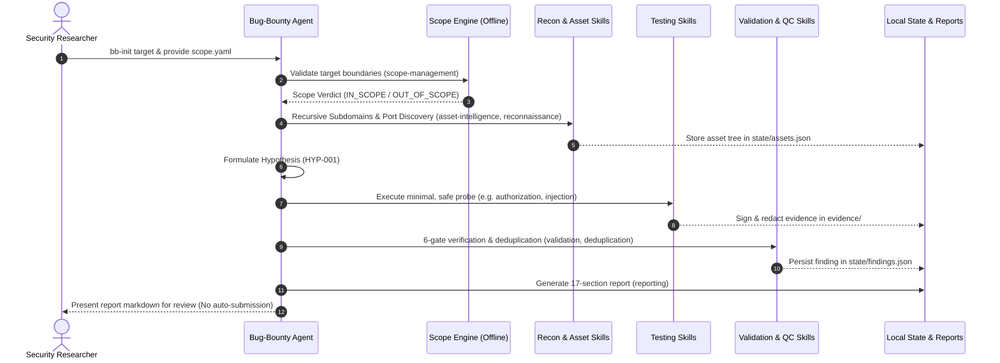

# BugBounty-Agent — Agent Reference

This document details the configuration, operational responsibilities, and behavioral constraints of the primary OpenCode agent in the BugBounty-Agent framework.

---

## Architecture Overview

BugBounty-Agent employs a **single unified OpenCode agent** named `Bug-Bounty`. All specialized security research domains are implemented as **17 modular skills** (`skills/`).

> [!NOTE]
> *Global Deployment Model*: `Bug-Bounty` is deployed globally to `~/.config/opencode/agents/Bug-Bounty.md` and `~/.config/opencode/skills/` via `bb-deploy`. This allows the agent to be launched from any directory on the research workstation (`cd ~`, `cd /tmp`, `cd ~/Desktop/BugBounty-Agent`). The Git repository remains the source-controlled canonical source of truth.

---

## Agent Specification: `Bug-Bounty`

* **Canonical Repository Source**: `agents/Bug-Bounty.md`
* **Global Target Location**: `~/.config/opencode/agents/Bug-Bounty.md`
* **Agent Name**: `Bug-Bounty`
* **Mode**: `primary`
* **Subagent Depth**: `1` (Direct skill orchestration; no subagent delegation)
* **Skills Active**: All 17 framework skills:
  1. `scope-management`
  2. `asset-intelligence`
  3. `reconnaissance`
  4. `web-security`
  5. `javascript`
  6. `api-security`
  7. `authorization`
  8. `injection`
  9. `business-logic`
  10. `cloud-security`
  11. `browser`
  12. `oob`
  13. `validation`
  14. `deduplication`
  15. `evidence`
  16. `reporting`
  17. `knowledge-research`

---

## Operational Workflow

---

## Core Responsibilities

1. **Deterministic Scope Binding**:
   - Enforces offline verification before any network packet is dispatched.
   - Respects depth constraints, wildcards, CIDR boundaries, and explicit exclusion rules.

2. **Asset Intelligence & Arbitrary-Depth Discovery**:
   - Executes recursive subdomain enumeration without artificial depth limits (`example.com` $\to$ `sub` $\to$ `dev` $\to$ `api` $\to$ `internal`).
   - Normalizes DNS records, IP addresses, ASNs, TLS SAN certificates, and CDN/cloud edges.

3. **Hypothesis-Driven Testing**:
   - Strictly prohibits blind automated scanners.
   - Formulates structured hypotheses:
     $$\text{Observation} \longrightarrow \text{Hypothesis} \longrightarrow \text{Targeted Safe Test} \longrightarrow \text{Evidence} \longrightarrow \text{Validation}$$

4. **Cryptographic Evidence Preservation**:
   - Calculates SHA-256 hashes for all HTTP interactions.
   - Automatically sanitizes session cookies, passwords, and API authorization tokens.
   - Stores runtime data locally in `~/BugBounty-Workspace/` outside the Git repository.

5. **Adversarial Quality Control**:
   - Challenges candidate findings against a 6-gate verification checklist.
   - Eliminates false positives, caching illusions, and generic WAF block pages.
   - Generates 17-section disclosure reports for human review with strictly zero automated external submissions.
