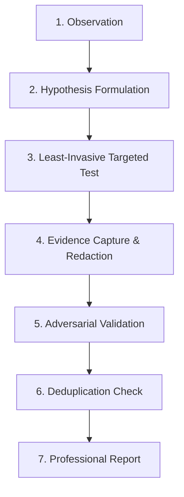

# BugBounty-Agent — Senior Researcher Workflow

BugBounty-Agent models the methodology of an elite security researcher. It rejects brute-force automated scanning in favor of hypothesis-driven investigation.

---

## 1. The Core Scientific Research Loop

### Stage 1: Observation
* What do we know about this asset?
* What technology is running?
* What endpoints or URL parameters are exposed?
* How does the application behave under standard user interaction?

### Stage 2: Hypothesis Formulation
Formulate a precise, falsifiable security statement:
* *Hypothesis*: "The endpoint `GET /api/v1/workspaces/{uuid}/members` verifies session validity but fails to check if the session user belongs to `{uuid}`, allowing cross-tenant member disclosure."
* *Falsification Criteria*: If the API returns `403 Forbidden` or `404 Not Found` when requesting an unowned workspace UUID, the hypothesis is disproven.

### Stage 3: Least-Invasive Targeted Test
* Do not fire indiscriminate scanner templates.
* Execute the minimum viable request to test the hypothesis using `bb-http`.
* Respect rate limits (maximum 5 requests/sec).

### Stage 4: Evidence Capture & Redaction
* Record raw HTTP request and response.
* Redact authentication tokens, session cookies, and personal customer data.
* Compute SHA-256 cryptographic digest of the evidence.

### Stage 5: Adversarial Validation
* Challenge the observation:
  * Could this be a generic error response disguised as a 200 OK?
  * Was the response served from an intermediate CDN cache?
  * What is the real-world business impact?

### Stage 6: Deduplication Check
* Compute test and finding fingerprints.
* Prevent multiple submissions for a single underlying flaw (e.g. 5 endpoints sharing the same unauthenticated middleware).

### Stage 7: Professional Disclosure Report
* Populate the 17 standard bug bounty sections in Markdown.
* Formulate concrete remediation guidance for software engineers.
* Present the report to the researcher for human review. Never auto-submit.
