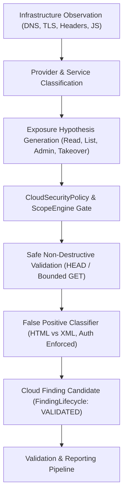

# Cloud Security & Misconfiguration Intelligence Methodology

## Core Objective
Evaluate cloud-hosted components, object storage repositories, serverless functions, and infrastructure configurations across AWS, Azure, GCP, Cloudflare, Fastly, DigitalOcean, and Oracle. Implement evidence-driven intelligence without blind scanning or destructive mutations.



---

## 1. Cloud Intelligence Workflow & Lifecycle

The research workflow strictly obeys the hypothesis-driven progression:
$$\text{Observation} \longrightarrow \text{Classification} \longrightarrow \text{Hypothesis} \longrightarrow \text{Safe Validation} \longrightarrow \text{Evidence} \longrightarrow \text{Finding Candidate}$$

1. **Ingest Existing Evidence**:
   * Consume DNS records, CNAMEs, and TLS SAN certificates from Phase 1 (`AssetGraph`).
   * Ingest HTTP response headers, server tokens, and CDN attributions from Phase 2/3 (`bb-http`).
   * Correlate masked cloud API keys and service credentials from Phase 4 (`bb-js`).
   * Extract API Gateway and backend endpoints from Phase 5 (`bb-api`).

2. **Multi-Signal Provider Fingerprinting**:
   * Deterministically identify cloud providers (AWS, Azure, GCP, Cloudflare, Fastly, DigitalOcean, Oracle).
   * Multi-signal scoring ensures higher confidence when DNS, TLS, and HTTP headers agree (e.g. `*.blob.core.windows.net` CNAME + `x-ms-*` headers).

3. **Cloud Service Identification**:
   * Categorize endpoints into specific architectural roles:
     * **Object Storage**: S3 buckets, Azure Blob containers, GCS buckets.
     * **CDN / Edge**: CloudFront, Azure Front Door, Fastly, Cloudflare.
     * **Container / Serverless**: Cloud Run, Cloud Functions, Lambda function URLs.
     * **App Hosting**: Azure App Service, Elastic Beanstalk, App Engine.
     * **Admin Interface**: Exposed management consoles, dashboards.

---

## 2. Hypothesis Formulation & Validation Boundaries

### A. Object Storage Repositories
* **Public Read (`PUBLIC_OBJECT_READ`)**: Verified via safe `HEAD` or bounded `GET` requests for a specific resource.
* **Public Listing (`PUBLIC_OBJECT_LISTING`)**: Verified by checking for valid XML listing schemas (`<ListBucketResult>`, `<EnumerationResults>`).
* **Suspected Write Exposure (`WRITE_CAPABILITY_SUSPECTED`)**:
  * **Strict Safety Rule**: Never attempt file uploads, deletions, or overwrites.
  * When write privileges are suspected, flag as `WRITE_CAPABILITY_SUSPECTED` for manual operator review. Automatic write execution is disabled.

### B. Dangling DNS & Cloud Takeover
* **Takeover Signatures (`POTENTIAL_CLOUD_TAKEOVER`)**:
  * AWS S3: `NoSuchBucket` / `The specified bucket does not exist`.
  * Azure App Service: `404 Web Site not found`.
  * GCP Storage: `BucketNotFound` / `NoSuchBucket`.
  * Fastly: `Fastly error: unknown domain`.
* **Safety Invariant**: Never attempt to register, claim, or take over target cloud infrastructure automatically.

### C. Unauthenticated Administrative Interfaces
* **Distinction**: Distinguish between internet-reachable public interfaces (`PUBLIC_INTERFACE`) and genuinely unauthenticated admin panels (`UNAUTHENTICATED_ADMIN_ACCESS`).
* **Login Barrier Check**: If an admin portal presents an SSO redirect, HTTP Basic prompt, or login form, it is NOT vulnerable.

---

## 3. False Positive Elimination Rules

The `CloudFalsePositiveClassifier` rejects non-vulnerable cloud behavior:
* **CDN Normalcy**: CloudFront or Cloudflare returning HTTP 200 for public web content is expected behavior, not an exposed storage bucket.
* **Access Control Working**: HTTP 403 Forbidden or `AccessDenied` proves cloud IAM access controls are actively enforced.
* **Web Hosting vs. Bucket Listing**: An S3 bucket configured for static website hosting returning standard HTML is NOT an object listing vulnerability.
* **Generic 404s**: Standard 404 Not Found responses without provider-specific unclaimed signatures are rejected as normal absent routes.

---

## 4. Operating Boundaries & Safety Invariants

* **ScopeEngine Precedence**: Every target URL must pass scope verification before any network request is issued.
* **Non-Destructive Requests Only**: Permitted HTTP methods are strictly bounded to `GET`, `HEAD`, and `OPTIONS`.
* **Zero Credential Attacks**: Never brute-force IAM passwords, test cloud credentials automatically, or exploit STS/OAuth flows.
* **Direct Metadata Probing Prohibited**: Probing `169.254.169.254` or cloud metadata services is strictly blocked in Phase 13.
* **Atomic State Persistence**: Cloud intelligence is atomically saved to `~/BugBounty-Workspace/programs/<program>/state/cloud.json`. Secrets are masked and sanitized before saving.

---

## 5. CLI Execution Guide

```bash
# Render visual cloud intelligence tree
./scripts/bb-cloud --program acme-corp --tree

# Perform passive cloud asset and service mapping
./scripts/bb-cloud --program acme-corp --passive-only --json

# Execute dry-run of planned non-destructive cloud validation checks
./scripts/bb-cloud --program acme-corp --dry-run

# Run safe, bounded validation probes
./scripts/bb-cloud --program acme-corp --validate

# Run 100% offline local cloud security laboratory (15 scenarios)
./scripts/bb-cloud --lab --tree
./scripts/bb-cloud --lab --validate
```
