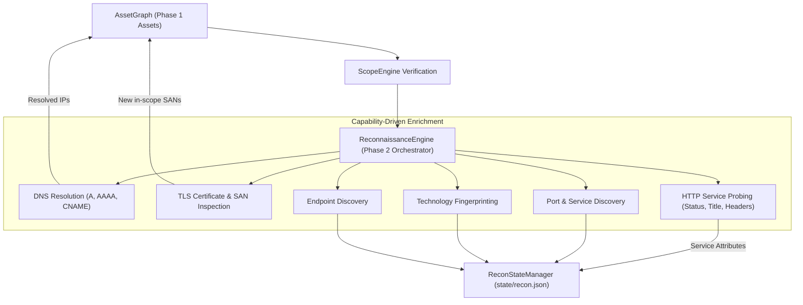

# Reconnaissance Methodology & Intelligence Engine

## Core Objective
Systematically map and enrich an organization's authorized external attack surface using passive intelligence feeds, controlled DNS resolution, HTTP service probing, TLS certificate metadata, technology fingerprinting, and endpoint discovery without exceeding safety budgets or generating disruptive traffic.

Reconnaissance consumes confirmed attack surface assets from the `AssetGraph` (Phase 1) and generates structured, normalized observations stored atomically in `state/recon.json` (Phase 2).

---

## 1. Reconnaissance Intelligence Architecture



---

## 2. Capability Orchestration & CLI Usage

The reconnaissance workflow is managed via `bb-recon`:

```bash
# Enrich all in-scope assets discovered in program workspace
bb-recon --program <program-name> --tree

# Run passive-only reconnaissance without active network probing
bb-recon --program <program-name> --passive-only

# Target specific capabilities on a specific asset
bb-recon --program <program-name> --asset api.example.com --capabilities "http,tls,tech"

# Resume previous reconnaissance run, skipping already-probed assets
bb-recon --program <program-name> --resume --tree

# Export structured JSON reconnaissance observations
bb-recon --program <program-name> --json
```

---

## 3. Supported Reconnaissance Capabilities

| Capability | Probing Method & Data Captured | Safety & Policy Rule |
| :--- | :--- | :--- |
| **`dns`** | A, AAAA, CNAME, MX, NS records; IPs enriched into `AssetGraph`. | Validated via `ScopeEngine`; passive DNS fallback available. |
| **`tls`** | SAN names, issuer, validity period, TLS version, cipher. Discovered in-scope SANs become new graph nodes. | Port 443 handshake; strict scope filtering on all SAN names before graph insertion. |
| **`http`** | URL, status code, title, server header, security headers, content length/type, redirect chain. | Rate-limited and bounded request ceilings (`--max-requests`). Default ports (80, 443). |
| **`ports`** | Port number, protocol (TCP), identified service, reachability status. | Explicitly bounded port list; aggressive port sweeps strictly prohibited by default. |
| **`tech`** | Server headers, framework signatures, CMS fingerprints, calibrated confidence (`OBSERVED`, `PROBABLE`, `CONFIRMED`). | Regex signatures across response headers; no disruptive or intrusive fuzzing. |
| **`endpoints`** | Discovered API paths and web routes (`METHOD URL`), status codes, content types. | Strictly opt-in; bound by `--budget` and endpoint ceilings. |

---

## 4. Multi-Source Provenance & Deduplication

* **Deterministic Normalization**: All URLs, endpoints, hostnames, and ports are normalized to canonical keys.
* **Observation Provenance**: Every observation attaches an `ObservationProvenance` record documenting originating tool/source, method, timestamp, and confidence rating.
* **Persistent Local State**: Observations are stored in `~/BugBounty-Workspace/programs/<name>/state/recon.json` using atomic replace writes (`_atomic_write_json`) to guarantee zero file corruption.
* **Resumability**: Assets flagged in `probed_assets` are skipped on subsequent runs with `--resume`.

---

## 5. Safety & Operational Rules

1. **Mandatory Scope Gate**: `ScopeEngine` verifies all targets before executing any network probes. Out-of-scope targets are skipped immediately.
2. **Deterministic Offline Testing**: All test suites utilize offline mock hooks (`http_probe_hook`, `dns_probe_hook`, `tls_probe_hook`, `port_scan_hook`, `endpoint_probe_hook`).
3. **Zero Shell Execution**: No `shell=True` or `os.system()` invocations.
4. **Git Isolation**: Target evidence, scan outputs, and `recon.json` remain local to Kali workspaces and are never committed to Git.
