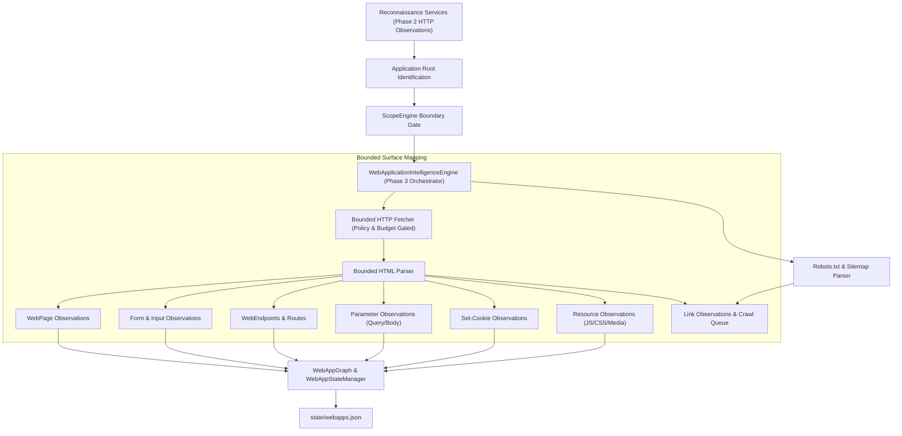

# Web Application Intelligence & Security Methodology

## Core Objective
Systematically map, model, and analyze web applications across their observable attack surface: applications, pages, routes, endpoints, query/body parameters, forms, cookies, and linked static/dynamic resources without executing intrusive vulnerability payloads.

Web Application Intelligence consumes confirmed web services from Phase 2 reconnaissance and constructs an authoritative attack surface relationship model stored atomically in `state/webapps.json` (Phase 3).

---

## 1. Web Application Intelligence Architecture



---

## 2. CLI Tool & Orchestration (`bb-webapp`)

The web application mapping workflow is invoked via `bb-webapp`:

```bash
# Map attack surface for all web applications in a program workspace
bb-webapp --program <program-name> --tree

# Restrict crawl to a specific application or asset with bounded budgets
bb-webapp --program <program-name> --asset app.example.com --max-pages 50 --max-depth 2

# Run passive analysis using existing Phase 2 observations without active requests
bb-webapp --program <program-name> --passive-only

# Resume previous crawl, skipping already-visited URLs
bb-webapp --program <program-name> --resume --tree

# Output complete JSON web application intelligence observations
bb-webapp --program <program-name> --json
```

---

## 3. Discovered Attack Surface Entities

| Entity | Model & Attributes Captured | Purpose in Lifecycle |
| :--- | :--- | :--- |
| **`WebApplication`** | Canonical base URL, host, scheme, port, page title, detected technologies, server banner. | Central anchor for application-level attack surface. |
| **`WebPage`** | Canonical URL, path, status code, content type, title, parent URL, depth, link/form counts. | Document nodes in navigation graph. |
| **`WebEndpoint`** | Method, canonical route, parameter names, parameter locations, response content type. | Identifies callable API routes and web endpoints. |
| **`ParameterObservation`** | Parameter name, location (`query`, `path`, `body`, `cookie`, `header`), method, datatype. | Input targets for subsequent targeted testing. |
| **`FormObservation`** | Form action URL, method (`POST`/`GET`), enctype, field names, input types, password/file flags. | Form submission vectors and authentication surfaces. |
| **`CookieObservation`** | Cookie name, domain, path, `Secure`, `HttpOnly`, `SameSite` attribute flags. | Session token tracking and security architecture review. |
| **`ResourceObservation`** | Resource URL, type (`js`, `css`, `image`, `json`, `wasm`), parent page, size. | Static asset inventory; feeds JavaScript Intelligence (Phase 4). |
| **`LinkObservation`** | Source URL, destination URL, same-origin flag, in-scope flag. | Navigation topology connecting pages and external systems. |

---

## 4. Crawl Policy & Safety Invariants

1. **Strict Scope Precedence**: Every candidate URL, form action, script URL, and redirected destination is verified against `ScopeEngine` before any HTTP request is issued. Out-of-scope targets are immediately rejected and recorded in `rejected_urls`.
2. **Conservative Defaults**:
   - `max_pages`: 500
   - `max_depth`: 3
   - `max_requests`: 2000
   - `max_response_bytes`: 2 MB (bounded read prevents memory exhaustion)
   - `same_origin_only`: True by default (prevents unintentional cross-domain crawls).
3. **No Vulnerability Exploitation**: Phase 3 is strictly mapping and intelligence gathering. Forms are **never automatically submitted**, inputs are never fuzzed, and application state is never mutated.
4. **Deterministic Normalization**: All URLs are canonicalized via `canonicalize_url()` (default ports stripped, path traversal resolved, fragments removed, query parameters sorted deterministically).
5. **Atomic State Persistence**: Stored in `~/BugBounty-Workspace/programs/<name>/state/webapps.json` using atomic temporary file swaps (`_atomic_write_json`).

---

## 5. HTTP / Header Trust & Protocol Security (Phase 11)

Header manipulation alone is never a finding. Phase 11 analyzes whether user-supplied metadata in headers is trusted by the server/proxy to produce a security-sensitive effect:

```
header manipulation → server/proxy trust → security-sensitive effect → proof → finding
```

### Key Capabilities & Vectors (`bb-http`)
* **Host Header Injection**: Tests whether `Host` controls password-reset URLs, invitation links, activation tokens, or OpenGraph URLs.
* **Proxy / Forwarded Trust**: Tests whether reverse-proxy headers (`X-Forwarded-Host`, `X-Original-Host`, `Forwarded`) take precedence over `Host`.
* **Scheme Trust**: Validates `X-Forwarded-Proto` and `X-Forwarded-Port` for scheme downgrade or insecure link generation.
* **Redirect Host Poisoning**: Evaluates whether `Location` redirect targets are poisoned to point to the researcher canary domain (`bb11-<program>-<id>.researcher-controlled.example`).
* **CORS Trust Boundaries**: Distinguishes public wildcard CORS (`*` without creds) from dangerous reflected origin with `Access-Control-Allow-Credentials: true`.
* **HTTP Parameter Pollution (HPP)**: Evaluates backend parser precedence (`FIRST_VALUE`, `LAST_VALUE`, `ARRAY`) when duplicate parameters are supplied.
* **Cache-Poisoning Foundation**: Inspects caching headers (`Cache-Control`, `X-Cache`, `Age`) and detects unkeyed header variations without aggressive shared-cache poisoning (`MANUAL_REVIEW_REQUIRED` for production safety).

```bash
# Run passive analysis and render ranked candidate tree
bb-http --program <program-name> --passive-only --tree

# Dry-run validation plan on target endpoint
bb-http --program <program-name> -e "https://app.example.com/login" --category host --dry-run

# Local deterministic security lab testing
bb-http --lab --tree
bb-http --lab -e "http://lab.local/auth/forgot-password" --approve
```
